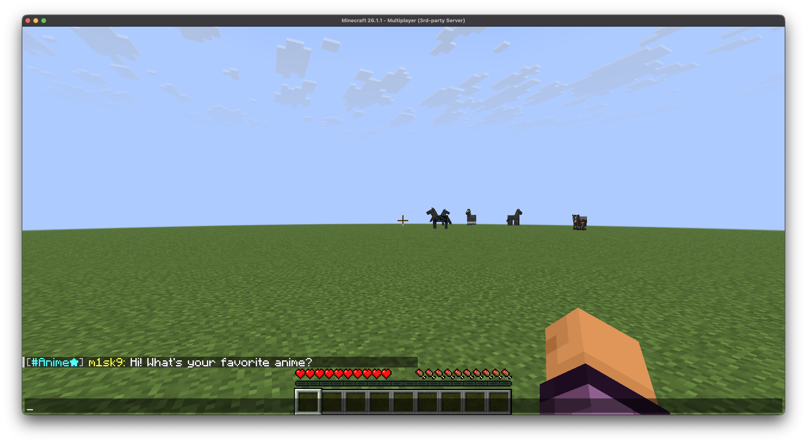
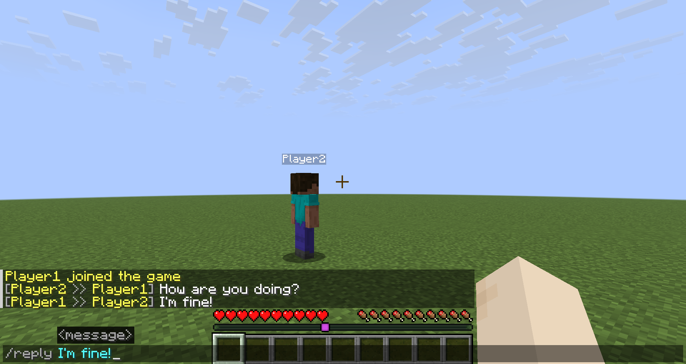
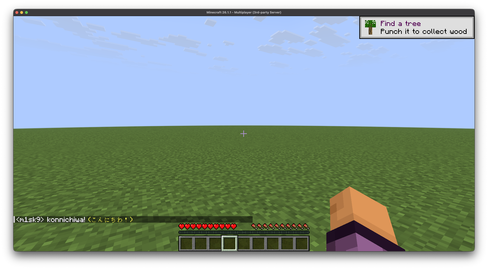
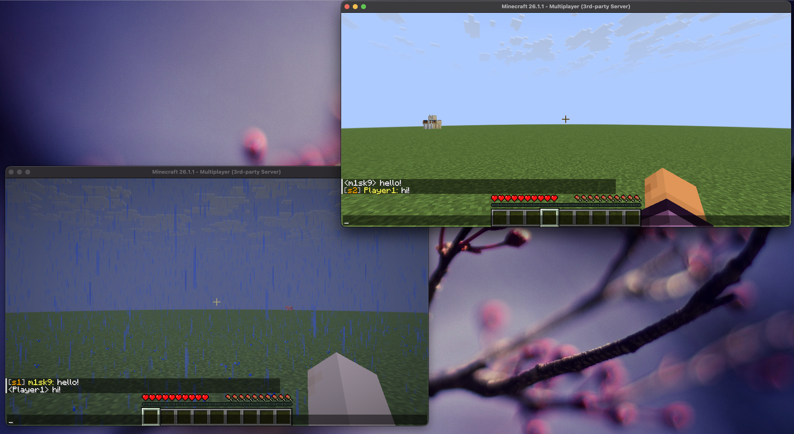

---
# https://vitepress.dev/reference/default-theme-home-page
layout: home

hero:
  name: 'LunaticChat'
  tagline: A next-generation chat plugin for Paper, Folia and Velocity.
  actions:
    - theme: brand
      text: Download
      link: /download
    - theme: brand
      text: Documentation
      link: /en/docs/getting-started
    - theme: alt
      text: GitHub
      link: https://github.com/m1sk9/LunaticChat

features:
  - title: Channel Chat
    details: Create and manage channels for group conversations between specific players. Includes private channels and moderation features.
    icon: ☎️
  - title: Direct Messages
    details: Send 1-on-1 chats with /tell or /msg commands. Quickly reply to the last sender with /reply.
    icon: ✉️
  - title: Romaji Conversion
    details: Automatically convert romaji input into Japanese. Fast performance powered by caching.
    icon: 🌍
  - title: Velocity Cross-Server Chat
    details: Relay global chat across multiple servers via a Velocity proxy. Join conversations from any server.
    icon: 🔗
  - title: Flexible Configuration
    details: Toggle features on/off with a YAML-based config file. Customize to fit your server's needs.
    icon: ⚙️
  - title: Latest Version Support
    details: Minimal external plugin dependencies, always supporting the latest Minecraft versions.
    icon: ⛏️
---

<!-- Section 1: Channel Chat (text left, image right) -->

  

    <h2>Organize Conversations with Channel Chat</h2>
    

      Create channels within your server to separate conversations by topic or group.
      Communicate with only the members you need, without flooding the global chat.
    

    <ul>
      <li>Create password-protected private channels</li>
      <li>Per-channel moderation (kick, mute, ban)</li>
      <li>Customizable join/leave notifications</li>
    </ul>
  

  

    
  

<!-- Section 2: Direct Messages (image left, text right) -->

  

    <h2>Direct Messages & Quick Reply</h2>
    

      Easily send private 1-on-1 chats between players.
      Use the <code>/reply</code> command to instantly respond to the last sender.
    

    <ul>
      <li>Send direct messages with <code>/tell</code> / <code>/msg</code></li>
      <li>Instantly reply to the last sender with <code>/reply</code></li>
      <li>Messages are visible only to the sender and recipient</li>
    </ul>
  

  

    
  

<!-- Section 3: Romaji Conversion (text left, image right) -->

  

    <h2>Automatic Romaji to Japanese Conversion</h2>
    

      Even in environments without Japanese input support, simply type in romaji and it will be automatically converted to Japanese.
      Powered by the Google IME API for natural conversion results.
    

    <ul>
      <li>Real-time romaji-to-Japanese conversion while chatting</li>
      <li>Fast performance with conversion result caching</li>
      <li>Per-player toggle to enable/disable conversion</li>
    </ul>
  

  

    
  

<!-- Section 4: Velocity Integration (image left, text right) -->

  

    <h2>Cross-Server Chat with Velocity</h2>
    

      Integrate with a Velocity proxy to relay global chat across multiple Paper/Folia servers.
      Players can join the same chat space regardless of which server they're on.
    

    <ul>
      <li>Relay regular chat to all servers in real time</li>
      <li>Fast communication via a custom plugin messaging protocol</li>
      <li>Backward compatibility guaranteed through protocol versioning</li>
    </ul>
  

  

    
  

<!-- Section 5: Platforms -->

  <h2>Multi-Platform Support</h2>
  
Flexibly deploy to match your server setup

  

    <a class="platform-card" href="https://papermc.io/software/paper/" target="_blank" rel="noopener">
      

        
      

      
Paper

      
The most widely used Minecraft server implementation. Full support for DM, channel chat, romaji conversion, and all features. Maintains compatibility with Bukkit/Spigot plugins.

    </a>
    <a class="platform-card" href="https://papermc.io/software/folia" target="_blank" rel="noopener">
      

        
      

      
Folia

      
A multithreaded server implementation by PaperMC. Provides a stable chat experience even on large-scale servers through region-based parallel processing.

    </a>
    <a class="platform-card" href="https://papermc.io/software/velocity" target="_blank" rel="noopener">
      

        
      

      
Velocity

      
A high-performance proxy server. Install the LunaticChat Velocity plugin to enable global chat relay across multiple Paper/Folia servers.

    </a>
  

